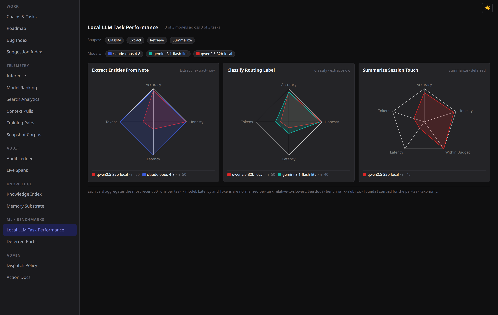
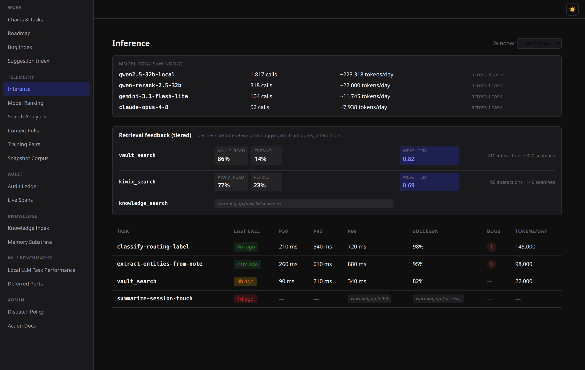
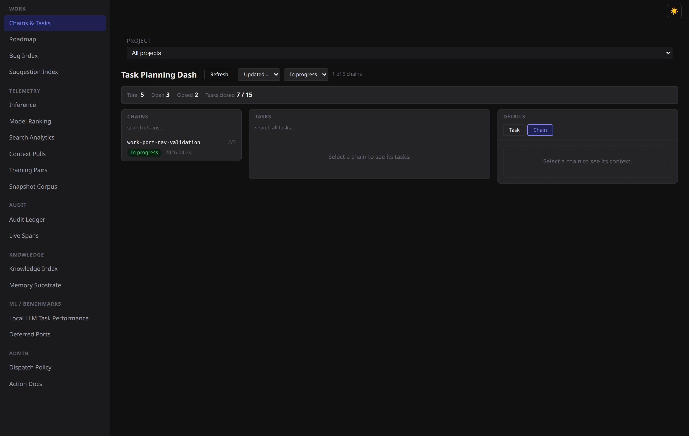

# toolkit-dashboard

A React + Vite SPA for observing the toolkit: chains, tasks, bugs, roadmap,
benchmarks, knowledge index, session routing, and Qwen inference stats.
Subscribes to the toolkit server's `/events` SSE stream for live updates.

## What you're looking at

A multi-page observability SPA over the toolkit's HTTP API — chain/task planning,
a per-task model-offload **benchmark radar**, and **live Qwen inference telemetry**.
The shots below are from the built-in sample data (`node dev-mock.mjs --dummy`) — no
backend required:

**Local-LLM benchmark radar** — per-task-shape offload verdicts, local Qwen vs. the cloud rungs:



**Live inference telemetry** — per-model call/token totals, tiered retrieval feedback, and a per-task latency/success table with staleness tinting:



**Chain & task planning** — the three-pane planning dash (chains → tasks → detail):



Split out of a larger backend monorepo into its own repo. The toolkit backend
now lives in the sibling
`sophdn/corpos-toolkit` repo; this app reaches it **only** over the HTTP observe API
(the `VITE_API_BASE_URL` boundary). Nothing here imports Go code at build time.

## Quick start

```bash
npm ci                     # install locked dependencies (first time)
npm run dev                # dev server on http://localhost:5180
```

Stop the dev server with **Ctrl-C**.

The dashboard needs the toolkit server's HTTP observe API reachable. Run the
toolkit (see the `sophdn/corpos-toolkit` README — `go/launch.sh` serves it on
`:3000` natively, or `systemctl --user start toolkit-server` for the
container), then point the dashboard at it (next section). Every page fetches
`${VITE_API_BASE_URL}/<endpoint>` and the SSE stream at `${VITE_API_BASE_URL}/events`.

## API base URL config (the toolkit boundary)

`VITE_API_BASE_URL` selects which toolkit server the dashboard talks to. It
defaults to `http://localhost:3000` when unset (see `src/lib/http.ts`). Set it
via `.env.local` (copy `.env.example`) or inline:

```bash
cp .env.example .env.local            # then edit VITE_API_BASE_URL
# or per-invocation:
VITE_API_BASE_URL=http://toolkit-host:3000 npm run dev
VITE_API_BASE_URL=http://toolkit-host:3000 npm run build   # output → dist/
```

The SSE subscription (`useEventBus`) follows the same base URL — there's no
separate event-bus URL. The toolkit's CORS layer is permissive, so a
different-origin dashboard works without a proxy.

## Build

```bash
npm run build              # tsc -b + vite build → dist/
npm run preview            # serve the production build locally
```

Serve `dist/` as static files behind any HTTP server for deployment.

## Container (rootless Podman)

The dashboard ships a Containerfile + Quadlet unit under `deploy/`. It is
**static-build-served**: a multi-stage build runs `vite build` in a node stage,
then serves the static `dist/` from `nginx-unprivileged` (non-root, no node
runtime at serve time — smaller image, no node attack surface). It's
individually `systemctl --user start|stop`-able.

```bash
scripts/build-image.sh                 # build localhost/toolkit-dashboard:dev + smoke-test
scripts/install-quadlet-units.sh       # install the Quadlet unit + daemon-reload
systemctl --user start  toolkit-dashboard
systemctl --user stop   toolkit-dashboard
```

It serves on **http://localhost:8082** (Quadlet `PublishPort=8082:8080`; nginx
listens on 8080 as a non-root user inside).

**API base URL is baked at build time.** Vite inlines `VITE_API_BASE_URL` into
the bundle, and the SPA calls the toolkit API **cross-origin** from the browser
(the toolkit's routes are unprefixed and collide with the SPA's own client-side
routes, so a same-origin reverse proxy isn't viable; the toolkit's CORS is
permissive, so cross-origin works). The default targets the toolkit
**container's** published port:

```bash
# default — toolkit container on the same host:
scripts/build-image.sh
# LAN browsers / a different toolkit endpoint — rebuild with the build arg:
VITE_API_BASE_URL=http://<host>:3001 scripts/build-image.sh
systemctl --user restart toolkit-dashboard
```

Retargeting the API therefore means a rebuild — consistent with the
`image-lags-HEAD` boundary (the running container never changes from source
edits; you advance it explicitly).

### Dev-mode escape hatch

To iterate without the container, stop it and run native vite:

```bash
systemctl --user stop toolkit-dashboard
npm run dev            # http://localhost:5180, VITE_API_BASE_URL from .env.local
```

No secrets are baked into the image and it mounts no host paths — the build is
self-contained and the only config is the build-time `VITE_API_BASE_URL`.

## Tests & gate

```bash
npm run lint               # eslint (flat config; fails on errors, warns otherwise)
npm run lint:fix           # eslint --fix (auto-fixable warnings)
npm test                   # vitest — unit + integration (jsdom, hermetic)
npm run test:e2e           # playwright — needs a reachable toolkit backend
```

`scripts/precommit.sh` is the single quality gate: **CSS-token-drift →
eslint → tsc --noEmit (app + config projects) → vitest**. Wire it as the
local pre-commit hook once after cloning:

```bash
bash scripts/install-hooks.sh
```

Gitea Actions CI (`.gitea/workflows/ci.yaml`) runs the equivalent gate
stages (lint, build, vitest) on every push and pull request, so local and CI
enforcement can't drift. The Playwright e2e journey suite is **not** in the
blocking gate — it needs a live toolkit backend; run it separately.

## Endpoints the dashboard reads

| Page                       | Endpoint(s)                                            |
| -------------------------- | ------------------------------------------------------ |
| Chains + Tasks             | `/chains`, `/chains/{slug}`, `/tasks`, `/tasks/search` |
| Bug Index                  | `/bugs` (client-side filter for `/bugs/{slug}`)        |
| Roadmap                    | `/roadmap`, `/roadmap/diff`                            |
| Session Routing            | `/session-routing/stats`                               |
| Qwen Inference             | `/inference/stats`                                     |
| Knowledge                  | `/knowledge/index-card`                                |
| Benchmarks                 | `/benchmarks/tasks`                                    |
| (live updates, every page) | `/events` SSE                                          |

## API contract boundary

The toolkit↔frontend boundary is the toolkit's observe HTTP surface (the
`/mcp/<surface>` dispatch + the observe routes above), served by
`sophdn/corpos-toolkit` (`go/internal/observehttp/`). This is now a **published
contract between two repos**, not a shared tree:

- **No Go imports.** All data comes via HTTP.
- **Wire types** in `src/api/*.ts` + `src/lib/*.ts` mirror the toolkit's
  observe responses. `src/api/types.gen.ts` is a generated snapshot of the Go
  response structs (originally via tygo in the monorepo). Regenerating it now
  requires the toolkit's Go source — a cross-repo codegen step tracked as a
  follow-up. Until then it's a committed snapshot; drift is caught by the
  parity tests in `src/api/*.test.ts` (decoded shapes vs fixture JSON from real
  toolkit responses).
